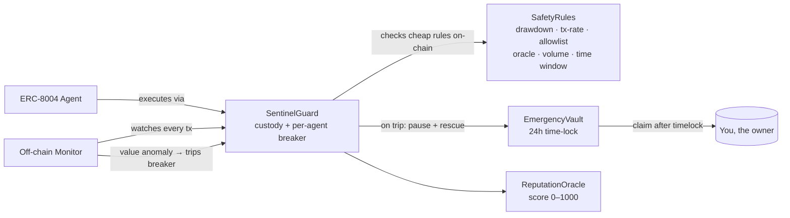

# Sentinel — The Circuit Breaker for Autonomous AI Agents

> Wrap your ERC-8004 agent. Set safety rules. Sleep at night.

   

**The problem:** an autonomous AI agent with access to funds can lose everything in minutes — a bad trade, a manipulated oracle, a runaway loop — and nobody is watching at 3am.

**Sentinel:** a non-custodial circuit breaker. Wrap your agent, configure safety rules, and an off-chain monitor auto-pauses the agent on-chain and routes its funds to a time-locked vault the moment it misbehaves. The monitor can only *freeze* — it can never move your money.

## Live

- **App:** https://agentsentinel.space
- **Network switch:** test the whole flow on **free Mantle Sepolia** before trusting real funds on **Mantle Mainnet** — toggle in the nav.
- **Contracts:** [verified on Mantlescan](https://mantlescan.xyz/address/0x929EC63c07A0d34358DF34ac073F2bf6eCF22642) (chain 5000)
- **Demo video:** _coming soon_
- **DoraHacks:** _submission link coming soon_

Built for the **Mantle Turing Test Hackathon 2026** — tracks: AI DevTools · AI × RWA · Agentic Economy.

> _Screenshot / GIF of `/watch` during a live circuit-breaker event goes here._

## How it works



**Two-layer defense.** Cheap, deterministic rules are enforced **on-chain** before an agent action executes. Value-based anomalies (drawdown, oracle deviation, daily volume) are detected **off-chain** by the monitor, which trips the breaker. Either way, the agent pauses and funds are recoverable only by the owner.

See [`docs/CONTRACT_ARCHITECTURE.md`](docs/CONTRACT_ARCHITECTURE.md) and [`monitor/ARCHITECTURE.md`](monitor/ARCHITECTURE.md).

## Why Mantle

Sentinel is built *for* the agentic economy Mantle is enabling. It speaks **ERC-8004** agent identity natively, guards Mantle's **RWA-native assets** (mETH, USDY, USDe) — accounting for mETH's rebasing yield so growth isn't flagged as drawdown — and relies on cheap **EigenDA** calldata to make per-tx on-chain rule checks economical. Gas is **MNT**, and the frontend accounts for Mantle's L1 data-fee component. It's a safety layer that only makes sense where autonomous agents actually manage real value: Mantle.

## Built for Mantle's agent-first economy (RealClaw / Byreal Skills)

Byreal's [RealClaw](https://www.byreal.io/en/realclaw/mantle) brings autonomous DeFi agents to Mantle — Stablecoin Farm, DCA, Copy Farm, and aggressive Swap strategies, with **Safe / Balanced / Aggressive** risk tiers and stop-losses. That's exactly the class of agent Sentinel exists to protect.

Sentinel generalizes RealClaw's per-strategy guardrails into **enforceable, on-chain circuit breakers**:

| RealClaw / Byreal Skill concept | Sentinel SafetyRule |
|---|---|
| Stop-loss threshold | `maxDrawdownBps` |
| Risk tier (Safe / Balanced / Aggressive) | a SafetyRules profile (tighter → looser limits) |
| Strategy scope (which protocols a skill touches) | protocol **allowlist** |
| Rate / size of automated actions | `maxTxPerHour`, `dailyVolumeCapUsd` |
| Depeg / oracle monitoring | `oracleDeviationBps` |

A RealClaw-style agent points its operating capital at a `SentinelGuard`, encodes its risk tier as SafetyRules, and gets an automatic **pause + fund rescue** the moment it breaches them — non-custodially, with funds recoverable only by the owner. RealClaw shows the demand for autonomous agents on Mantle; **Sentinel is the kill switch.**

> Scope note: this is a complementary safety layer, not a fork of Byreal. RealClaw is non-custodial (Privy split-key) and ships no public agent SDK today, so Sentinel guards agents of this *class* rather than calling a Byreal API.

## Status

| Phase | Status |
|---|---|
| 1 — Foundation & skeleton deploy | ✅ Done |
| 2 — Full contract suite | ✅ Done — 5 contracts, **180/180** tests, 100% coverage |
| 3 — Off-chain monitor | ✅ Done — **50** vitest tests, anomaly engine + Pyth + SSE + health |
| 4 — Frontend | ✅ Done — 6 pages, redesigned, deployed to Vercel |
| 5 — Demo agents + mainnet | ✅ Done — live + seeded on Mantle Mainnet; first breaker fired on-chain |
| 6 — Polish + submission | 🔄 In progress |

## Live contracts

**Mantle Mainnet (chain 5000)** — all verified:

| Contract | Address |
|---|---|
| SentinelGuard | [`0x929EC63c…CF22642`](https://mantlescan.xyz/address/0x929EC63c07A0d34358DF34ac073F2bf6eCF22642) |
| AgentRegistry | [`0x5c570A7C…F549356`](https://mantlescan.xyz/address/0x5c570A7C3De89bd4E27df65D6aFafD66DF549356) |
| ReputationOracle | [`0x2688B012…1463a7f`](https://mantlescan.xyz/address/0x2688B0125E22fDAE168fb3B3B7635A8fF1463a7f) |
| EmergencyVault | [`0x7A1E8Ea5…Ce3cCe5`](https://mantlescan.xyz/address/0x7A1E8Ea5a054879dE96C01973b3D67ad2Ce3cCe5) |
| AgentIdentityRegistry | [`0xbbb12950…be8CA91`](https://mantlescan.xyz/address/0xbbb129508fdCCB59334432c5C3d6b4251be8CA91) |

`EmergencyVault` enforces a **24-hour** timelock on mainnet.

**Mantle Sepolia (chain 5003)** — full suite verified, for free testing (`EmergencyVault` timelock 5 min): SentinelGuard [`0xf4bB2b95…8Be0ba7`](https://sepolia.mantlescan.xyz/address/0xf4bB2b95414A1fE100310e85FD24e12e88Be0ba7). Full list in [`contracts/deployments/sepolia.json`](contracts/deployments/sepolia.json).

## Stack

- **Contracts:** Solidity 0.8.24 + Foundry. Custom errors, SafeERC20, ReentrancyGuard, full NatSpec.
- **Monitor:** Node.js 20+ + TypeScript (strict) + viem + native `node:sqlite`.
- **Frontend:** Next.js 14 (app router) + Tailwind + wagmi + RainbowKit + shadcn/ui.
- **Demo agents:** TypeScript + viem (no ethers) + node-cron.

## Repo layout

```
contracts/    Foundry project — 5 contracts, 180 tests, deploy scripts, deployments/
monitor/      off-chain anomaly engine + SSE event hub + /health
web/          Next.js 14 frontend (landing · onboard · watch · dashboard · agent · leaderboard)
demo-agents/  3 agents that intentionally misbehave so Sentinel can save them
docs/         contract + UI architecture, brand assets
```

## Quick start

```bash
pnpm install

# Contracts
cd contracts && forge build && forge test -vvv

# Web (local dev)
cd web && pnpm dev          # http://localhost:3000

# Monitor (serves /health, /events SSE, /agents on :8080)
cd monitor && cp ../.env.example .env   # fill MONITOR_PRIVATE_KEY + RPC
pnpm dev

# Demo agents — use `pnpm run <script>` (bare `pnpm setup` hits pnpm's builtin)
cd demo-agents && cp .env.example .env  # DEPLOYER_PRIVATE_KEY + MONITOR_PRIVATE_KEY
#   DEMO_NETWORK=sepolia for free testnet, or mainnet for real
pnpm run setup                          # mint 3 NFTs + deploy rules + register + fund
pnpm run manual:trigger yieldchaser MAX_DRAWDOWN   # fire the breaker for the demo
```

Frontend network: `NEXT_PUBLIC_CHAIN_ID=5000` (mainnet) or `5003` (sepolia) sets the default; the in-app toggle switches at runtime.

## Hardening / design notes

- **No role can move user funds except the user.** The monitor wallet can only pause and emit events.
- `rescueToSafety` always routes to the immutable `EmergencyVault` — no arbitrary recipient.
- No upgradeability proxies in v1 — breaking changes deploy fresh contracts.
- `mETH` rebases; detectors subtract reference yield before flagging drawdown.

## Hackathon tracks

- **AI DevTools** — Sentinel is infrastructure for anyone shipping autonomous agents.
- **AI × RWA** — guards Mantle-native RWA assets (mETH/USDY/USDe).
- **Agentic Economy** — ERC-8004-style agent identity + an on-chain reputation scoreboard.

## Team & contact

- GitHub: [zaxcoraider/sentinel-mantle](https://github.com/zaxcoraider/sentinel-mantle)
- X / contact: _add before submission_

## License

MIT
