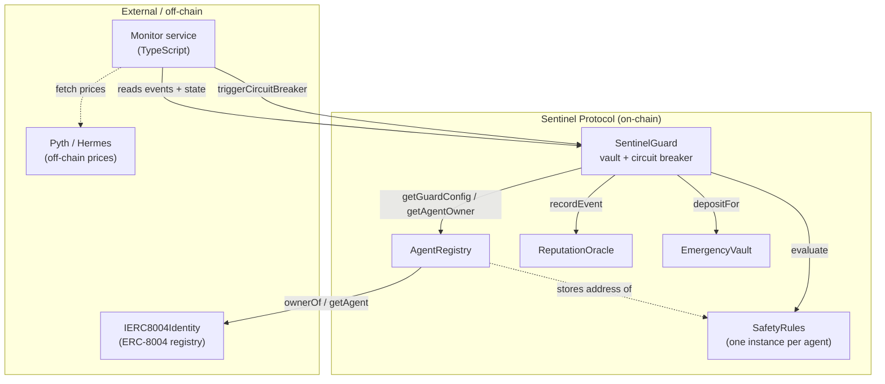

# Sentinel — Contract Architecture

> Design document for the full Sentinel smart-contract suite on Mantle Network.
> **Status:** Draft for review (Phase 2.1). No Solidity written yet.

---

## 1. System overview

Sentinel is a **circuit breaker for autonomous AI agents**. A human wraps their
ERC-8004 agent into Sentinel, configures safety rules, and deposits the agent's
operating capital into a custody vault. The agent operates *through* the vault.
An off-chain monitor watches every agent and, on a critical anomaly, pauses that
agent on-chain. The human can then move the frozen funds into a timelocked
emergency vault.

### Actors

| Actor | Who it is | Trust level | Can do |
|---|---|---|---|
| **Human owner** | The person behind the agent. Holds the ERC-8004 identity NFT. | High (cold key) | Deposit, configure rules, rescue funds, unpause |
| **Agent** | The bot key that executes strategy. NOT the owner. | Medium (hot key) | Call `executeAsAgent` only |
| **Monitor** | Off-chain service with a hot wallet. | Low (hot key) | Pause an agent — nothing else |
| **Anyone** | Public. | None | Read reputation, deposit *for* an agent |

### Core security property

> **No role in Sentinel can move a user's funds except that user.**
> Not the monitor, not the deployer, not a protocol admin. The monitor can only
> *freeze*. Moving funds requires the ERC-8004 NFT owner's signature. There is no
> god-admin over custody. The deployer can renounce `ReputationOracle` ownership
> after setup, leaving the protocol with zero privileged custody roles.

---

## 2. Contract dependency graph



**Dependency direction:** `SentinelGuard` depends on all others. `AgentRegistry`
depends only on the external ERC-8004 interface. `ReputationOracle`,
`EmergencyVault`, and `SafetyRules` are leaves (no Sentinel dependencies). This
ordering means **no circular deploy dependency** — authorization that points
"backwards" (oracle → guard) is wired via an owner-setter *after* deploy.

---

## 3. Two-layer defense model

Safety rules are enforced in **two places**, because some checks are cheap
on-chain and others need off-chain pricing:

| Layer | Where | Checks | On violation |
|---|---|---|---|
| **Layer 1 — Prevention** | `SentinelGuard.executeAsAgent`, synchronous | pause state, protocol allowlist, tx-rate, time-of-day window | The agent's call **reverts**. Not a breaker — the bad action simply never executes. |
| **Layer 2 — Detection** | Off-chain monitor, asynchronous | drawdown vs high-water-mark, oracle deviation, 24h volume cap | Monitor calls `triggerCircuitBreaker` → the agent is **paused**. Catches value-based anomalies that already happened. |

**Key insight:** Layer 1 reuses the *existing* `SafetyRules.evaluate()` with no
new code. `executeAsAgent` builds a *partial* `AgentState` — value/price/volume
fields set to `0`. `evaluate()` already guards those branches (`if (highWaterMark
> 0)`, `if (lastPriceUsed > 0 && lastReferencePrice > 0)`), so a zero-filled
state naturally exercises **only** the on-chain-checkable rules. The monitor
fills the same struct completely for Layer 2.

---

## 4. Contract designs

### 4.1 SafetyRules.sol *(already implemented — Phase 1.2)*

**Purpose.** Per-agent rule configuration and evaluator. Each guarded agent owns
one instance, owned by the agent's human. Stores six rules and exposes
`evaluate(AgentState)` returning `(bool safe, bytes32 violatedRule)`.

**No changes needed.** Documented here for completeness. It is `Ownable`
(owner = agent's human). Rules: `maxDrawdownBps`, `maxTxPerHour`,
`oracleDeviationBps`, `dailyVolumeCapUsd`, `timeOfDay[Min|Max]`,
`allowedProtocols` mapping. Custom errors, events (`RuleUpdated`,
`ProtocolAllowlistChanged`, `RuleViolated`), full NatSpec. 24 tests passing.

> Each agent deploys its own `SafetyRules` during onboarding (the user's wallet
> sends the deploy tx). No factory contract — `AgentRegistry`'s `AgentGuarded`
> event is the single enumeration source for the frontend.

---

### 4.2 IERC8004Identity.sol *(interface only — do not fork)*

**Purpose.** Minimal interface to the curated ERC-8004 Identity Registry
(`mantlenetworkio/erc-8004-contracts`). Sentinel never forks it — it reads
through this interface.

```
function ownerOf(uint256 tokenId) external view returns (address);
function getAgent(uint256 tokenId) external view returns (address agentAddress, string memory registrationURI);
```

For testnet and unit tests we deploy a `MockIdentityRegistry` (an OpenZeppelin
`ERC721` with a `getAgent` mapping) so the registration path is single-codepath
everywhere — no special "stub mode" branching in production code.

---

### 4.3 AgentRegistry.sol

**1. Purpose.** The ERC-8004 ↔ Sentinel bridge. Records which agents are guarded,
links each to its identity NFT, its `SafetyRules` instance, and its
`SentinelGuard`. It is the source of truth for "who owns this agent" — every
owner-gated action in `SentinelGuard` resolves through here.

**2. State variables.**

| Variable | Type | Justification |
|---|---|---|
| `identityRegistry` | `IERC8004Identity` (immutable) | The ERC-8004 registry. Set once at deploy. |
| `_configs` | `mapping(address agent => GuardConfig)` | Per-agent config. `internal` + view getter to return a clean struct. |
| `agentByToken` | `mapping(uint256 tokenId => address agent)` | Reverse lookup; also enforces one-agent-per-token. |

`struct GuardConfig { uint256 erc8004TokenId; address rulesContract; address guardContract; uint64 registeredAt; bool active; }` — `uint64` timestamp packs with `bool` to save a slot.

**3. External functions.**

- `register(uint256 erc8004TokenId, address rulesContract, address guardContract)` — `@notice` Register an ERC-8004 agent under Sentinel. Resolves `agentAddress` via `getAgent`, requires `ownerOf(tokenId) == msg.sender`, requires the agent and token are not already registered.
- `deregister(address agent)` — `@notice` Mark an agent inactive (history retained). Only the current NFT owner.
- `getGuardConfig(address agent) → GuardConfig` — `@notice` Full config. Used by the monitor and `SentinelGuard`.
- `getAgentOwner(address agent) → address` — `@notice` **Live** `ownerOf(tokenId)` call, so ownership stays correct even if the NFT is transferred.
- `isGuarded(address agent) → bool` — `@notice` True if registered and active.
- `rulesOf(address agent) → address` — convenience getter for `SentinelGuard`.

**4. Events.** `AgentGuarded(address indexed agent, uint256 indexed tokenId, address rules, address guard)`, `AgentDeregistered(address indexed agent, uint256 indexed tokenId)`.

**5. Custom errors.** `NotTokenOwner()`, `AlreadyRegistered(address agent)`, `TokenAlreadyUsed(uint256 tokenId)`, `NotRegistered(address agent)`, `ZeroAddress()`.

**6. Access control.** `register` — anyone holding the NFT. `deregister` — current NFT owner only. Everything else is `view`. **No contract owner** — authority derives purely from ERC-8004 NFT ownership.

**7. Inheritance / imports.** None from OpenZeppelin except the `IERC8004Identity` interface. Ownerless by design.

**8. Gas.** Deploy ≈ **0.9–1.3M**. `register` ≈ 90–120k (two new SSTOREs + one external `ownerOf` + one `getAgent`). `deregister` ≈ 30k.

**9. Security.** No funds held — zero reentrancy surface. `getAgentOwner` does a live external call; if the ERC-8004 registry reverts, owner-gated actions fail *closed* (safe). One-agent-per-token and not-already-registered checks prevent hijack/duplication.

---

### 4.4 ReputationOracle.sol

**1. Purpose.** An on-chain, public scoreboard. Every guarded agent accrues a
safety score in `[0, 1000]`. `SentinelGuard` reports lifecycle events; anyone can
query a score to decide whether to trust an agent. Drives the public leaderboard.

**2. State variables.**

| Variable | Type | Justification |
|---|---|---|
| `_reps` | `mapping(address agent => Reputation)` | Current score + metadata. `Reputation { uint16 score; uint64 lastUpdated; uint32 eventCount; bool initialized; }` — all in one slot. |
| `_history` | `mapping(address agent => RepEvent[])` | Append-only audit log. `RepEvent { EventType eventType; uint64 timestamp; int16 delta; uint16 scoreAfter; }`. |
| `authorizedReporters` | `mapping(address => bool)` | Which contracts may call `recordEvent` (the `SentinelGuard`). Owner-managed so a redeployed guard can be re-authorized. |

Constants: `INITIAL_SCORE = 500`, `MAX_SCORE = 1000`, `MIN_SCORE = 0`.
`enum EventType { CleanDay, RuleViolation, CircuitBreaker, SuccessfulRecovery, SlashingEvent }`.

**3. External functions.**

- `recordEvent(address agent, EventType eventType)` — `@notice` Apply a score delta. Only an authorized reporter. First call for an agent seeds the score at 500, then applies the delta.
- `getReputation(address agent) → (uint256 score, uint256 lastUpdated, uint256 eventCount)` — `@notice` Current standing. Uninitialized agents report `500`.
- `getAgentHistory(address agent, uint256 offset, uint256 limit) → RepEvent[]` — `@notice` Paginated event log.
- `historyLength(address agent) → uint256` — total events, for pagination.
- `addAuthorizedReporter(address)` / `removeAuthorizedReporter(address)` — owner only.

**4. Events.** `ReputationChanged(address indexed agent, int256 delta, uint256 newScore, EventType reason)`, `ReporterAuthorized(address indexed reporter, bool authorized)`.

**5. Custom errors.** `NotAuthorizedReporter()`, `ZeroAddress()`.

**6. Access control.** `recordEvent` — authorized reporters only. Reporter management — `Ownable` owner (deployer; **may renounce after wiring** for full decentralization). Reads — public.

**7. Inheritance / imports.** `Ownable` (for reporter management).

**Score model.**

| EventType | Delta | Notes |
|---|---|---|
| `CleanDay` | `+1` | Capped at `MAX_SCORE`. |
| `RuleViolation` | `-50` | Floored at `MIN_SCORE`. |
| `CircuitBreaker` | `-200` | The big penalty. |
| `SuccessfulRecovery` | `+10` | Rewards a clean rescue. |
| `SlashingEvent` | `0` | **Reserved for v2** (stake slashing). No-op in v1. |

**8. Gas.** Deploy ≈ **0.8–1.1M**. `recordEvent` ≈ 50–75k (one struct SSTORE + one array push). `getAgentHistory` is `view` (free off-chain; paginated to bound on-chain callers).

**9. Security.** Holds no funds. `recordEvent` gated to authorized reporters — a rogue caller cannot grief scores. `_history` grows unbounded (≈365 entries/yr from `CleanDay`); acceptable, and reads are paginated. No reentrancy surface.

---

### 4.5 EmergencyVault.sol

**1. Purpose.** A timelocked safe-deposit box for rescued funds. When a human
rescues a frozen agent, `SentinelGuard` pushes the funds here, credited to that
human. The human withdraws after a fixed delay. Segregating rescued funds into a
separate contract keeps them away from the live `SentinelGuard` custody logic.

**2. State variables.**

| Variable | Type | Justification |
|---|---|---|
| `withdrawDelay` | `uint256` (immutable) | Timelock length. Set at deploy. |
| `balances` | `mapping(address beneficiary => mapping(address token => uint256))` | Per-beneficiary, per-token holdings. `NATIVE = address(0)`. |
| `unlockAt` | `mapping(address beneficiary => mapping(address token => uint256))` | Earliest claim timestamp; refreshed on each deposit. |

**3. External functions.**

- `depositFor(address beneficiary, address token, uint256 amount)` — `@notice` Deposit ERC-20 credited to `beneficiary`; pulls via `safeTransferFrom`; sets `unlockAt = now + withdrawDelay`. Permissionless (gifting funds to a beneficiary is harmless).
- `depositNativeFor(address beneficiary) payable` — `@notice` Same, for native MNT.
- `claim(address token)` — `@notice` Withdraw an ERC-20 balance to `msg.sender` after the timelock.
- `claimNative()` — `@notice` Withdraw native MNT after the timelock.
- `claimableAt(address beneficiary, address token) → uint256` — view.

**4. Events.** `RescueDeposited(address indexed beneficiary, address indexed token, uint256 amount, uint256 unlockAt)`, `RescueClaimed(address indexed beneficiary, address indexed token, uint256 amount)`.

**5. Custom errors.** `StillLocked(uint256 unlockAt)`, `NothingToClaim()`, `ZeroAddress()`, `ZeroAmount()`, `NativeTransferFailed()`.

**6. Access control.** Deposits — permissionless. Claims — only the credited beneficiary, and only after the timelock. **No contract owner.**

**7. Inheritance / imports.** `ReentrancyGuard`, `SafeERC20`.

**8. Gas.** Deploy ≈ **0.8–1.1M**. `depositFor` ≈ 55–80k. `claim` ≈ 40–60k.

**9. Security.** `nonReentrant` on both claim paths; checks-effects-interactions (zero the balance before transfer). Native sends use low-level `call` with success check. The timelock is a deliberate cooling-off and audit window — funds are *already* safe (out of the agent's reach) the instant rescue completes; the delay only governs final extraction to the human's wallet.

---

### 4.6 SentinelGuard.sol *(Phase 1 skeleton → full rewrite)*

**1. Purpose.** The custody vault and circuit breaker. Holds each agent's
operating capital, lets the agent act through `executeAsAgent` (gated by Layer-1
rules), lets the monitor freeze a misbehaving agent, and lets the human rescue a
frozen agent's funds into the `EmergencyVault`. **Per-agent** pause — one frozen
agent never blocks the others.

> **Change from Phase 1:** the skeleton used OpenZeppelin `Pausable` (global) and
> `Ownable` (single owner). Phase 2 removes both: pause becomes per-agent state,
> and authority becomes per-agent via `AgentRegistry`/ERC-8004. `SentinelGuard`
> has **no contract owner**.

**2. State variables.**

| Variable | Type | Justification |
|---|---|---|
| `monitor` | `address` (immutable) | The only address that may pause. Immutable — see §9. |
| `registry` | `IAgentRegistry` (immutable) | Resolves agent → owner / rules / active. |
| `reputation` | `IReputationOracle` (immutable) | Reports breaker + recovery events. |
| `emergencyVault` | `IEmergencyVault` (immutable) | Fixed rescue destination. |
| `balanceOf` | `mapping(address agent => mapping(address token => uint256))` | Per-agent custody ledger. `NATIVE = address(0)`. |
| `_agentTokens` | `mapping(address agent => EnumerableSet.AddressSet)` | ERC-20s an agent holds, so rescue can drain them all. |
| `isPaused` | `mapping(address agent => bool)` | Per-agent circuit-breaker state. |
| `pausedAt` | `mapping(address agent => uint64)` | Trigger time, for the unpause cooldown. |
| `hourlyTxCount` | `mapping(address agent => mapping(uint256 hourBucket => uint256))` | On-chain tx-rate tracking (`hourBucket = block.timestamp / 3600`). |

Constants: `UNPAUSE_COOLDOWN = 1 hours`, `NATIVE = address(0)`.

**3. External functions.**

- `depositForAgent(address agent, address token, uint256 amount)` — `@notice` Fund an agent with an ERC-20. Requires the agent is guarded; pulls via `safeTransferFrom`; credits `balanceOf`; adds the token to the agent's set.
- `depositNativeForAgent(address agent) payable` — `@notice` Fund an agent with native MNT.
- `executeAsAgent(address target, bytes calldata data, uint256 value, address approveToken, uint256 approveAmount) → bytes` — `@notice` The agent acts through the vault. Caller must be the registered agent; agent must not be paused. Runs the **Layer-1** rule check; on failure **reverts** (no breaker). Optionally `forceApprove(target, approveAmount)` so a DEX can pull `approveToken`, executes `target.call{value: value}(data)`, then resets the approval to `0`. Native refunds are re-credited to the agent.
- `triggerCircuitBreaker(address agent, bytes32 reason)` — `@notice` Freeze an agent. **Monitor only.** Sets `isPaused`/`pausedAt`, calls `reputation.recordEvent(agent, CircuitBreaker)`, emits. Cannot move funds.
- `ownerPauseAgent(address agent)` — `@notice` Owner panic button. The agent's ERC-8004 owner freezes their own agent immediately, without waiting for the monitor. Sets `isPaused`/`pausedAt`, emits `AgentPausedByOwner`. Does **not** apply a reputation penalty — proactive caution is not misbehavior.
- `rescueToSafety(address agent)` — `@notice` Move **all** of a paused agent's funds (native + every tracked ERC-20) into the `EmergencyVault`, credited to the agent's verified owner. Only the agent's owner; only while paused. Calls `reputation.recordEvent(agent, SuccessfulRecovery)`.
- `unpauseAgent(address agent)` — `@notice` Resume an agent after the owner has resolved the incident. Only the agent's owner; only after `UNPAUSE_COOLDOWN` from `pausedAt`.
- Views: `getAgentTokens(agent) → address[]`, `txCountThisHour(agent) → uint256`, plus the public mappings.
- `receive() payable {}` — accepts native silently (required so external-call refunds land); bare sends are **not** credited to any agent — use `depositNativeForAgent`.

**4. Events.** `Deposited(address indexed agent, address indexed token, uint256 amount, address indexed from)`, `AgentExecuted(address indexed agent, address indexed target, uint256 value, bytes4 selector)`, `CircuitBreakerTriggered(address indexed agent, bytes32 indexed reason, uint256 timestamp)`, `AgentPausedByOwner(address indexed agent, uint256 timestamp)`, `FundsRescued(address indexed agent, address indexed beneficiary, uint256 tokenCount)`, `AgentUnpaused(address indexed agent, uint256 timestamp)`.

**5. Custom errors.** `NotMonitor()`, `NotAgentOwner()`, `CallerNotAgent()`, `AgentNotGuarded(address agent)`, `AgentIsPaused(address agent)`, `AgentNotPaused(address agent)`, `CooldownActive(uint256 readyAt)`, `RuleCheckFailed(bytes32 rule)`, `ProtocolCallFailed(bytes returnData)`, `InsufficientBalance()`, `ZeroAddress()`, `ZeroAmount()`, `NativeTransferFailed()`.

**6. Access control.**

| Function | Caller |
|---|---|
| `depositForAgent`, `depositNativeForAgent` | Anyone (funding an agent is safe) |
| `executeAsAgent` | The registered agent address only |
| `triggerCircuitBreaker` | `monitor` only |
| `ownerPauseAgent`, `rescueToSafety`, `unpauseAgent` | The agent's ERC-8004 owner only (live `registry.getAgentOwner`) |

**7. Inheritance / imports.** `ReentrancyGuard`; `SafeERC20`, `EnumerableSet`, `IERC20`. **No `Ownable`, no `Pausable`.**

**8. Gas.** Deploy ≈ **2.0–2.8M** (the heaviest contract — watch the 24KB EIP-170 limit; optimizer `runs = 200`). `depositForAgent` ≈ 70–100k. `executeAsAgent` ≈ 90–160k + the external call. `triggerCircuitBreaker` ≈ 60–90k. `rescueToSafety` ≈ 60k + ~30k per token drained.

**9. Security.**

- **Reentrancy.** `executeAsAgent` makes an *arbitrary external call* — the main surface. Mitigations: `nonReentrant` (OZ's lock is contract-wide, so a reentrant call cannot re-enter `executeAsAgent`, `depositForAgent`, or `rescueToSafety`); checks-effects-interactions (tx-count incremented, approval set *before* the call); approval is bounded and reset to `0` after. A reentrant caller cannot pause (monitor-gated) or rescue (owner-gated + not-paused).
- **Monitor containment.** The monitor can *only* pause. It can never call `rescueToSafety`, never `executeAsAgent`, never touch `balanceOf`. A compromised monitor is a **DoS risk only** (griefing pauses) — never a fund-loss risk. That is why `monitor` can safely be immutable: rotation = redeploy the guard, and users re-`register` pointing at it.
- **Approval hygiene.** `executeAsAgent` resets allowance to `0` post-call so no lingering allowance survives. `target` must pass the Layer-1 protocol allowlist.
- **Rescue safety.** `rescueToSafety` has a fixed destination (`EmergencyVault`) — no `recipient` parameter, so a human acting under stress (or a phished signature) cannot send funds to an attacker. Destination is immutable.
- **Fail-closed.** Owner checks do a live `registry.getAgentOwner` call; if the registry or ERC-8004 reverts, owner-gated actions fail closed.

---

## 5. Access-control matrix

| Function | Human owner | Agent | Monitor | Anyone |
|---|:--:|:--:|:--:|:--:|
| `SafetyRules.*` setters | ✅ | — | — | — |
| `AgentRegistry.register` | ✅ (owns NFT) | — | — | ✅ (owns NFT) |
| `AgentRegistry.deregister` | ✅ | — | — | — |
| `SentinelGuard.depositForAgent` | ✅ | ✅ | ✅ | ✅ |
| `SentinelGuard.executeAsAgent` | — | ✅ | — | — |
| `SentinelGuard.triggerCircuitBreaker` | — | — | ✅ | — |
| `SentinelGuard.ownerPauseAgent` | ✅ | — | — | — |
| `SentinelGuard.rescueToSafety` | ✅ | — | — | — |
| `SentinelGuard.unpauseAgent` | ✅ | — | — | — |
| `ReputationOracle.recordEvent` | — | — | — | guard only |
| `EmergencyVault.claim*` | ✅ (beneficiary) | — | — | — |

---

## 6. Deploy order, wiring & gas budget

No circular dependency — leaves first, then wire authorization backwards.

1. **ReputationOracle** `(deployerOwner)`
2. **EmergencyVault** `(withdrawDelay)`
3. **AgentRegistry** `(identityRegistry)` — on testnet, deploy `MockIdentityRegistry` first
4. **SentinelGuard** `(monitor, registry, reputation, emergencyVault)`
5. **Wire:** `ReputationOracle.addAuthorizedReporter(sentinelGuard)`
6. *(optional)* `ReputationOracle.renounceOwnership()` once wiring is confirmed

| Contract | Est. deploy gas |
|---|---|
| ReputationOracle | 0.8–1.1M |
| EmergencyVault | 0.8–1.1M |
| AgentRegistry | 0.9–1.3M |
| SentinelGuard | 2.0–2.8M |
| **Total (protocol)** | **≈ 4.5–6.3M** |

Each user pays their own `SafetyRules` deploy (~1.0–1.4M) at onboarding. At
Mantle's low MNT gas price the full protocol deploy lands **well under the $20
budget** — the build-plan figure is conservative.

---

## 7. Resolved decisions

The three judgment calls below were reviewed and **locked in** before
implementation:

1. **`rescueToSafety` destination — locked: always the EmergencyVault.** No
   `recipient` parameter. Rescue routes all funds to the immutable
   `EmergencyVault`, credited to the verified owner. Removes fat-finger and
   phished-recipient risk; the human withdraws anywhere after the timelock.

2. **`EmergencyVault.withdrawDelay` — locked: 24 h mainnet / 5 min testnet.**
   Immutable constructor arg, set per network. Funds are safe the instant rescue
   completes; the delay only governs final extraction.

3. **Owner panic button — locked: `ownerPauseAgent` added.** The agent's
   ERC-8004 owner can freeze their own agent without waiting for the monitor.
   Strictly weaker than `rescueToSafety` (already owner-callable), so no new
   risk. Does not apply a reputation penalty.

Implementation order: `IERC8004Identity` + `AgentRegistry` (2.3) →
`ReputationOracle` (2.4) → `EmergencyVault` → rewrite `SentinelGuard` (2.5),
with full Foundry tests and `forge coverage > 90%` at each step.
