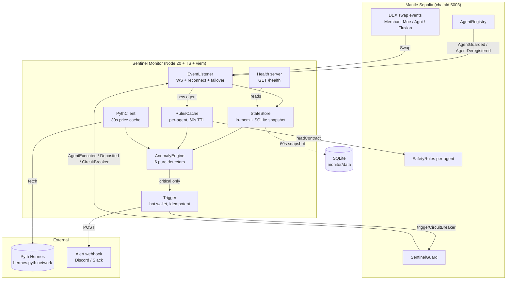

# Sentinel Monitor — Architecture

> The off-chain brain. Watches Mantle in real time, detects agent misbehavior the
> on-chain rule check can't see, and trips the circuit breaker before funds are lost.
>
> Phase 3 design doc (PROMPT 3.1). **No implementation yet — review this first.**

## 1. Why an off-chain monitor exists

`SentinelGuard.executeAsAgent` already runs an **on-chain (Layer-1) rule check** on
every action: protocol allowlist, hourly tx rate, time-of-day window. Those revert
the action atomically. But that check is *blind* to the things that actually drain an
agent:

- It sees `currentValue = 0`, `highWaterMark = 0` (no portfolio valuation on-chain).
- It sees `lastPriceUsed = 0`, `lastReferencePrice = 0` (no oracle on-chain at exec time).
- It sees `volume24hUsd = 0` (no rolling accounting on-chain).

The monitor is **Layer-2**: it reconstructs the *real* portfolio value, real traded
prices, and real 24h volume off-chain — from events plus Pyth — and trips
`triggerCircuitBreaker` when an agent crosses a threshold the chain couldn't catch.

| Concern | On-chain (SafetyRules.evaluate) | Off-chain (this monitor) |
|---|---|---|
| Protocol allowlist | ✅ reverts the call | ✅ defense-in-depth (catches via DEX events) |
| Tx rate / hour | ✅ reverts the call | ✅ corroborates |
| Time-of-day window | ✅ reverts the call | ✅ corroborates |
| **Drawdown vs high-water-mark** | ❌ value is 0 | ✅ **primary detector** |
| **Oracle price deviation** | ❌ prices are 0 | ✅ **primary detector** (Pyth) |
| **24h volume cap** | ❌ volume is 0 | ✅ **primary detector** |

The monitor never holds funds. Per the contract's threat model, the monitor wallet
can only `triggerCircuitBreaker` (pause). A compromised monitor is a DoS at worst —
it can never move money. (`SentinelGuard.sol:20-23`.)

## 2. Watched contracts (Mantle Sepolia, chainId 5003)

From `contracts/deployments/sepolia.json`:

| Contract | Address | Why we watch it |
|---|---|---|
| AgentRegistry | `0x5c570A7C3De89bd4E27df65D6aFafD66DF549356` | Discover / drop agents to watch |
| SentinelGuard | `0x929EC63c07A0d34358DF34ac073F2bf6eCF22642` | Agent activity, deposits, breaker state |
| ReputationOracle | `0x2688B0125E22fDAE168fb3B3B7635A8fF1463a7f` | (read-only) score context |
| EmergencyVault | `0x7A1E8Ea5a054879dE96C01973b3D67ad2Ce3cCe5` | (read-only) rescue confirmations |
| SafetyRules (per-agent) | discovered from `AgentGuarded.rulesContract` | Read each agent's thresholds |

**Monitor hot wallet** (`0x92e8652423f53Ac10F2523A5d652e11F370Adfb6`) is the only
address `triggerCircuitBreaker` accepts — `SentinelGuard.sol:42, 116-119`. Fund it with
~1 MNT for gas. **Never** put user funds here (CLAUDE.md hard rule #7).

### Exact event signatures (source of truth — copied from the contracts)

```
// AgentRegistry.sol
event AgentGuarded(address indexed agent, uint256 indexed tokenId, address rulesContract, address guardContract);
event AgentDeregistered(address indexed agent, uint256 indexed tokenId);

// SentinelGuard.sol
event Deposited(address indexed agent, address indexed token, uint256 amount, address indexed from);
event AgentExecuted(address indexed agent, address indexed target, uint256 value, bytes4 selector);
event CircuitBreakerTriggered(address indexed agent, bytes32 indexed reason, uint256 timestamp);
event AgentPausedByOwner(address indexed agent, uint256 timestamp);
event FundsRescued(address indexed agent, address indexed beneficiary, uint256 tokenCount);
event AgentUnpaused(address indexed agent, uint256 timestamp);

// SafetyRules.sol (per-agent instance)
event RuleViolated(bytes32 indexed ruleKey, uint256 expected, uint256 actual);
event RuleUpdated(bytes32 indexed ruleKey, uint256 oldValue, uint256 newValue);
event ProtocolAllowlistChanged(address indexed protocol, bool allowed);
```

`triggerCircuitBreaker(address agent, bytes32 reason)` — the `reason` we pass **is**
the `SafetyRules` rule key (`keccak256("MAX_DRAWDOWN")`, etc.). Reusing those exact
constants keeps the on-chain `CircuitBreakerTriggered.reason` and the off-chain anomaly
type aligned, so the frontend can decode one enum.

## 3. Component diagram



## 4. Module list

All under `monitor/src/`. One responsibility each; pure logic isolated from I/O so it
is unit-testable without a chain.

| Module | Responsibility | Talks to |
|---|---|---|
| `index.ts` | Composition root. Wire listener → engine → trigger; start health server; load snapshot on boot. | everything |
| `config.ts` | Load + validate env (RPCs, keys, addresses, webhook). Throws typed `ConfigError` on missing vars. No hardcoded RPCs (hard rule #5). | env |
| `chain.ts` | viem clients: `publicClient` (WS primary + HTTP fallback) and `walletClient` (monitor hot wallet). Mantle Sepolia chain def, MNT as native. | viem |
| `listener.ts` | `EventListener`: WS subscriptions, exponential-backoff reconnect, primary→fallback RPC failover. Emits `agentRegistered` / `agentDeregistered` / `agentTx` / `deposit` / `breakerFired`. (PROMPT 3.2) | chain, store |
| `state.ts` | `StateStore`: per-agent `AgentState` in memory; recompute HWM, txCount/hour, volume24h on each event; SQLite snapshot every 60s; restore on boot. | better-sqlite3 |
| `rules-cache.ts` | `RulesCache`: `readContract` each agent's SafetyRules; cache 60s. | chain |
| `pyth.ts` | `PythClient`: fetch latest price from Hermes; 30s cache; map token→feedId. (PROMPT 3.3) | axios/fetch |
| `anomaly.ts` | `AnomalyEngine`: 6 pure detectors + `evaluateAll`. Returns `AnomalyResult[]`. (PROMPT 3.3 — the brain) | none (pure) |
| `trigger.ts` | `Trigger`: gas-estimate, +20% priority fee, `triggerCircuitBreaker`, 1 conf, 5-min idempotency, JSONL audit log, webhook alert. (PROMPT 3.4) | chain, fs |
| `health.ts` | Tiny HTTP server: `GET /health` → `{ status, lastBlock, uptime, agentsWatched }`. | http |
| `types.ts` | Shared types: `AgentState`, `AnomalyType`, `AnomalyResult`, `Severity`, `SafetyRulesSnapshot`. viem `Address`/`Hex`, never `string` (CLAUDE.md). | — |
| `log.ts` | Structured logger (level, ts, agent, event). | — |

## 5. Core data shapes

```ts
// Mirrors ISafetyRules.AgentState, but off-chain we actually fill the value/price fields.
interface AgentState {
  agent: Address;
  guard: Address;
  rules: Address;
  currentValueUsd: bigint;     // 18dp, computed from balances × Pyth
  highWaterMarkUsd: bigint;    // 18dp, max(currentValue) ever seen
  txCountThisHour: number;
  hourBucket: number;          // block.timestamp / 3600
  lastCalledProtocol: Address;
  lastPriceUsed: bigint;       // 18dp, from agent's last swap
  lastReferencePrice: bigint;  // 18dp, Pyth at same moment
  volume24hUsd: bigint;        // 18dp, rolling
  lastSeenBlock: bigint;
  updatedAt: number;
}

type AnomalyType =
  | 'MAX_DRAWDOWN' | 'MAX_TX_PER_HOUR' | 'ALLOWED_PROTOCOLS'
  | 'ORACLE_DEVIATION' | 'DAILY_VOLUME' | 'TIME_WINDOW';

interface AnomalyResult {
  anomaly: boolean;
  type: AnomalyType;
  reasonHash: Hex;             // keccak256(type) — matches SafetyRules RULE_* constant
  severity: 'warn' | 'critical';
  message: string;
}
```

Only `severity === 'critical'` fires the on-chain breaker; `warn` is logged + (optional)
webhook. A two-tier model gives demos a "warning → trip" narrative and avoids tripping
on noise (e.g. mETH rebasing yield is growth, never a drawdown — CLAUDE.md gotcha).

## 6. Data flow: event in → detection → trigger out

```
1. WS event AgentExecuted(agent, target, value, selector)        [listener.ts]
2. StateStore.apply(event): bump txCount/hour, set lastCalledProtocol,
   recompute currentValueUsd from balances × Pyth, update HWM, add volume  [state.ts]
3. RulesCache.get(agent) → SafetyRulesSnapshot (60s cached readContract)   [rules-cache.ts]
4. PythClient.get(token) → reference price (30s cached)                    [pyth.ts]
5. AnomalyEngine.evaluateAll(state, rules, ctx) → AnomalyResult[]          [anomaly.ts]
6. const critical = results.find(r => r.severity === 'critical')
7. if (critical) Trigger.fire(agent, critical.reasonHash, critical.message) [trigger.ts]
     - skip if isPaused[agent] on-chain OR fired < 5 min ago (idempotent)
     - estimateGas, +20% maxPriorityFee, send, wait 1 conf
     - append monitor/data/triggers.log.jsonl, POST webhook
```

## 7. Anomaly detectors (Layer-2 thresholds, read from SafetyRules)

Each is a pure function `(state, rules, ctx) → AnomalyResult`, mirroring the on-chain
math in `SafetyRules.evaluate` (`SafetyRules.sol:249-297`) so off-chain and on-chain
agree on what "violation" means:

- **detectDrawdown** — `(HWM-current)/HWM` in bps > `maxDrawdownBps` → critical.
- **detectTxRate** — `txCountThisHour` > `maxTxPerHour` → critical (warn at 80%).
- **detectProtocolViolation** — `lastCalledProtocol` not in allowlist → critical.
- **detectOracleDeviation** — `|used-ref|/max(used,ref)` bps > `oracleDeviationBps` → critical.
- **detectDailyVolume** — `volume24hUsd` > `dailyVolumeCapUsd` → critical (warn at 80%).
- **detectOffHours** — `currentHourUtc` outside `[timeOfDayMin, timeOfDayMax]` (handles overnight wrap) → warn (off-hours alone rarely warrants a freeze).

`reasonHash` = the matching `SafetyRules` constant so the chain event self-describes.

## 8. Error handling & resilience

- **RPC drop:** WS auto-reconnect, exponential backoff (1s → 2s → … cap 30s, jitter).
  After N failures on primary, fail over to `MANTLE_RPC_FALLBACK`; keep retrying primary
  in background and switch back when healthy. Log every transition.
- **Missed blocks during downtime:** on reconnect, `getLogs` from `lastSeenBlock` so no
  event is dropped while disconnected.
- **Pyth unavailable:** serve last cached price within a max-staleness bound; if stale
  beyond bound, *skip* oracle-deviation detection (fail-open on that one rule) rather than
  false-trip — never trust off-chain price without on-chain corroboration (hard rule #8).
- **Trigger tx fails:** retry once with a higher fee; if still failing, log critical +
  webhook page. Never crash the loop — one bad agent must not blind the monitor to others.
- **Restart safety:** SQLite snapshot every 60s; on boot, restore state then backfill
  via `getLogs`. Idempotent trigger means a restart can't double-fire.
- **Per-agent isolation:** all detection wrapped per-agent in try/catch; a throw on one
  agent is logged and skipped, never propagated.

## 9. Local dev vs production

| | Local | Production |
|---|---|---|
| Network | Mantle Sepolia (5003) | Sepolia for demo; Mainnet (5000) post-judging |
| Run | `pnpm dev` (tsx watch) | `pnpm build && pnpm start` (compiled dist) |
| State | `monitor/data/*.db` (gitignored) | persistent volume |
| Secrets | `.env` (never committed) | platform secrets |
| Deploy target | — | **Railway.app** (simplest persistent Node + volume; Fly.io as alt) |
| Health | `localhost:8080/health` | platform healthcheck → `/health` |

Railway is the pick: free tier runs a always-on Node worker with a mounted volume for
the SQLite snapshot, env-var secrets, and a healthcheck hook — no Docker needed.

## 10. Build sequence (Phase 3 prompts)

1. **3.2** `listener.ts` + `chain.ts` + `state.ts` skeleton + `test/listener.test.ts` (Sonnet)
2. **3.3** `anomaly.ts` + `pyth.ts` + `rules-cache.ts` + `test/anomaly.test.ts` + `monitor:debug` CLI (Opus)
3. **3.4** `trigger.ts` + wire `index.ts` + `health.ts` + run 10 min vs Sepolia, capture logs (Sonnet)

## 11. Notes / cleanups flagged

- `package.json` lists `ethers@^6` — CLAUDE.md forbids ethers v6 in new code. **Remove it**;
  everything here is viem. Will drop it when 3.2 lands.
- Add `axios` is already present for Pyth (or use native `fetch` on Node 20 — leaning fetch
  to shed a dep).
- `monitor/data/` must be added to `.gitignore` (SQLite + JSONL audit logs).
- Mantle gas: `triggerCircuitBreaker` cost = L2 exec + L1 data fee. Use `eth_estimateL1Fee`
  when surfacing cost in the audit log (CLAUDE.md Mantle gotcha).
```
